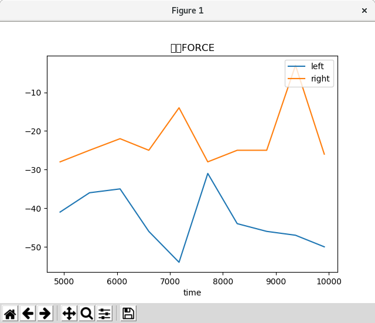

# Python real time graph

This tool is develop to plot graph in real time by getting value from serial port.

## Option

There are some options to launch and configure grapher :

1. Serial port (by default `/dev/ttyUSB0`)
2. Serial baud rate (by default `115200`)
3. Number of point to display (by default `300`)
4. Time interval between each update (by default `10ms`)
5. Reset arduino, or not (by default `no`)
6. Save csv data in file (by default `no`)

## Example

```
$ ./main.py --help
usage: main.py [-h] [-s SERIAL] [-b BAUDRATE] [-m MAX_POINT] [-i INTERVAL]
               [-v] [-r] [-S SAVE]

optional arguments:
  -h, --help            show this help message and exit
  -s SERIAL, --serial SERIAL
                        Serial port
  -b BAUDRATE, --baudrate BAUDRATE
                        Baud rate of serial port
  -m MAX_POINT, --max-point MAX_POINT
                        Number max of point to display
  -i INTERVAL, --interval INTERVAL
                        Time interval between each update of screen (in ms)
  -v, --verbose         Enable verbose mode
  -r, --reset           Reset arduino when launch program
  -S SAVE, --save SAVE  Save data in filename give in argument
$ # Launch appli with next parameter : interval 20ms, 100 points, reset arduino and save data in file test.csv
$ ./main.py -m 100 -i 20 --reset --save test.csv
```

## Serial format data

Serial data must respect this template :
* The first line is title of graph
* The second line is legend of graph
* All other line is data (one point by line)

* The data separator is `;`
* First data is always x axis (as *time* in example)
* You can add as much as possible data

```
TITLE OF GRAPH
X-legend;y-legend-1;y-legend-2;y-legend-N
x;y1;y2;yN
x;y1;y2;yN
...
```

## Example

We launch tool with 10 points and interval of 500ms `./main.py -i 500 -m 10`.

```
\x00\x00FORCE
time;left;right
446;-31;-13
1000;-35;-10
1576;-44;-32
2134;-49;-17
2691;-49;-18
3267;-37;-24
3823;-44;-24
4367;-56;-20
4924;-41;-28
5480;-36;-25
6057;-35;-22
6600;-46;-25
7171;-54;-14
7714;-31;-28
8270;-44;-25
8827;-46;-25
9371;-47;-3
9915;-50;-26
```


